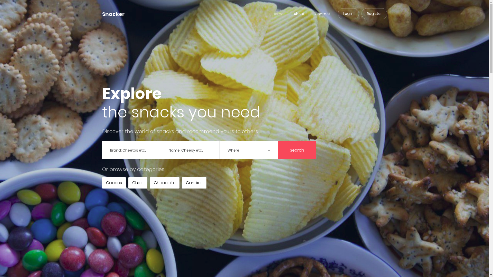
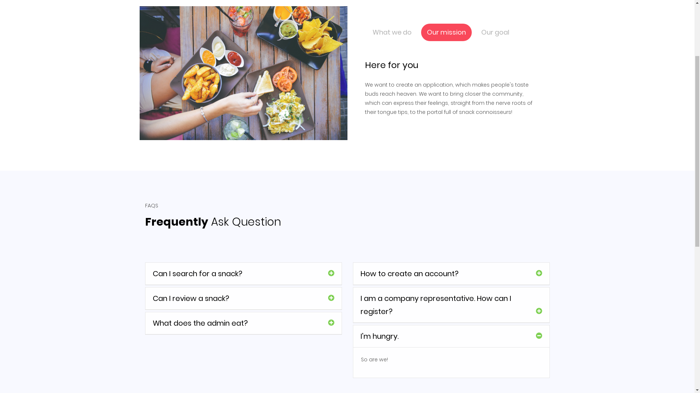
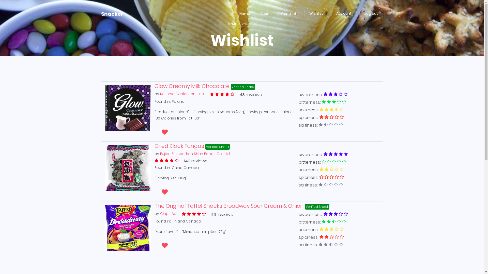

# Snacker :birthday:  :cookie:

Your best snacking buddy. Your place to go for all snack related information. Browse and review any snacks and get personalized recommendations!

<p align="center"> </p>

[intermediary demo (video)](https://youtu.be/FosvNqKSG8o)

[Final dem (video)](https://www.youtube.com/watch?v=ZIszrKrW3gM)

# Contributors

* **Jayde Yue** - [@JaydeYue](https://github.com/JaydeYue)
* **Juliano Garcia** - [@robotenique](https://github.com/robotenique)
* **Adam** - [@Adam5i](https://github.com/Adam5i)
* **Flora Shi** - [@tjflorashi](https://github.com/tjflorashi)
* **Alex Chum** - [@AlexChum](https://github.com/AlexChum)
* **Harry Chen** - [@hchen96](https://github.com/hchen96)
* **Giuliano Celani** - [@Giuliano-C](https://github.com/Giuliano-C)

# Screenshots

<p align="center"> </p>
<p align="center"> </p>
<p align="center"> </p>


# Setup

We are using Python with the Flask framework, and the PyCharm IDE.
Links:

Flask: http://flask.pocoo.org/

Pycharm IDE: https://www.jetbrains.com/pycharm/ (Download community version)

1. **Install Required libraries**

OBS: Some libraries are related to the recommender system ML training, you can skip those if you don't want to train the model by yourself.
You can always check the **requirements.txt** for all the libraries.

```bash
$ pip install Flask flask-bcrypt dnspython mongoengine Flask-WTF Pillow Flask-Table flask_login pycountry numpy matplotlib
```

2. **Create database access files**

In the folder ```snacker/flaskr``` create two files: ```username.txt``` and ```password.txt```. Inside them, put the names of any member of this team (first name), for example, in BOTH files, write just "Juliano" (without quotes, and notice the capitalized letter).
OBS: If you want to test with a local database, we have a dump of the database which can be downloaded [here](https://drive.google.com/open?id=145Mzq3XrnMTMX1boBqd2Hqk7bqvRDT1V). You need to use *mongorestore* with the *--dir* flag to restore it.

3. **Download the Machine Learning Recommender model**

You could train the model yourself by using ```snacker/flaskr/recommender_training.py```, but the best approach is to download the model file, which is hosted [here](https://drive.google.com/file/d/1lkAtTsvf7FWqAManP8KsZkWrq0bHYlt6/view?usp=sharing). Download the file, and put it in the folder ```snacker/flaskr```. This model is loaded by the file ```snacker/flaskr/recommender_recommend.py```, so make sure you downloaded and the filename is correct (should be **recc_model.pickle**).

4. **Login information**

For testing purposes, we have added ~5000 users to the application. Here are some users you can log in. Some users are made to be as though they are accessing the application from a specific country. If country not specified, it will use the current country the user last logged in.

**Normal users**

* email: otto.joki@example.com , password: 123456   (Likes spicy and sweet, user is accessing from China)
* email: inmaculada.perez@example.com , password: 123456 (Likes salty and spicy, user is accessing from Mexico)
* email: gertrudes.silva@example.com, password: 123456 (Likes sweet and salty, user is accessing from Brazil)
* email: juliano@example.com , password: 123456

**Company users**
* email: Test2@Test2.com , password: Test2


### Run the application

You can run the application inside PyCharm, by clicking on the 'Run' button, or using `shift + F10`.

You can also run the application with debug mode on terminal, by using (on linux):

```bash
$ cd snacker/flaskr
$ export FLASK_APP='app.py' FLASK_ENV=debug
$ flask run
```

Windows cmd (Powershell different)

```
$ cd snacker/flaskr
$ set FLASK_APP=app.py
$ flask run
```

To test the code, go to your local url displayed on the console and refresh the page, you should see printed stuff from db operations on your console. If having troubles, ask for help in groupchat.

### Basic Debugging
If something won't work, first try closing your broswer, re-run flask and open it again in incognito mode. Sometimes new js won't load.
