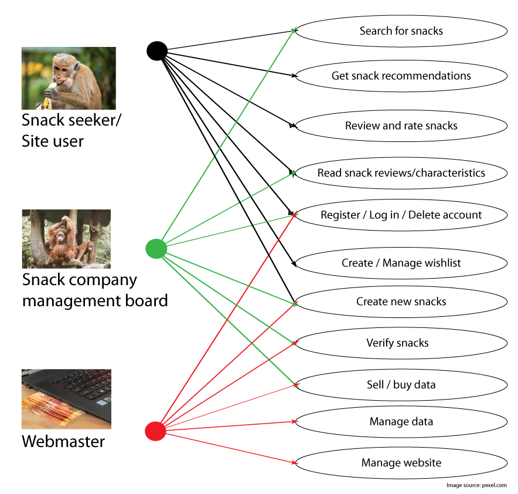
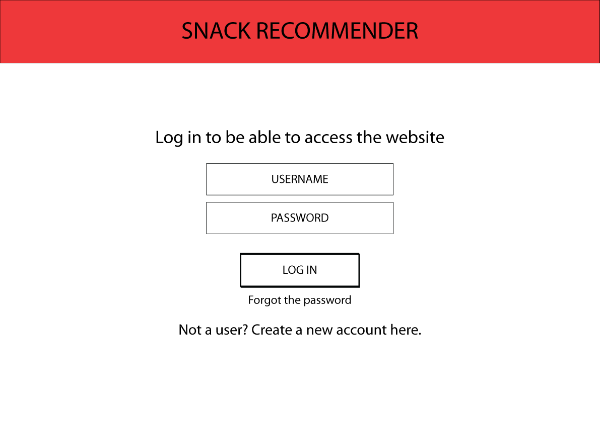
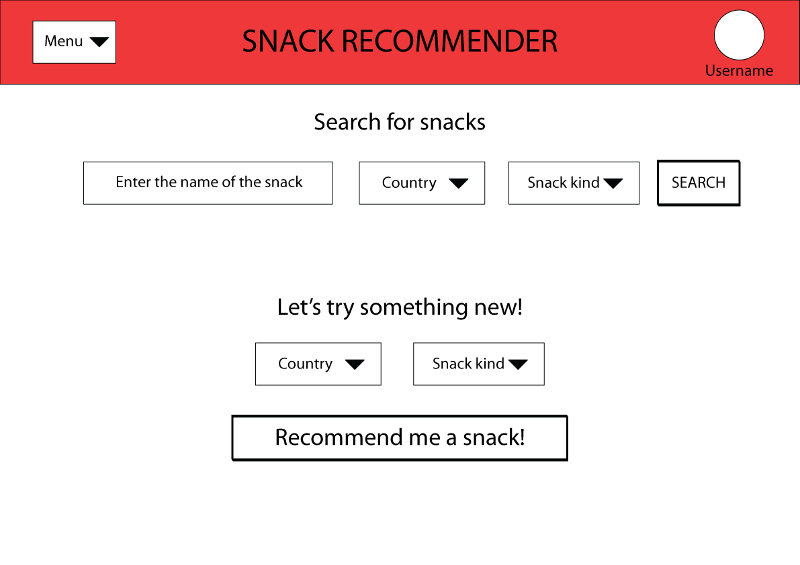
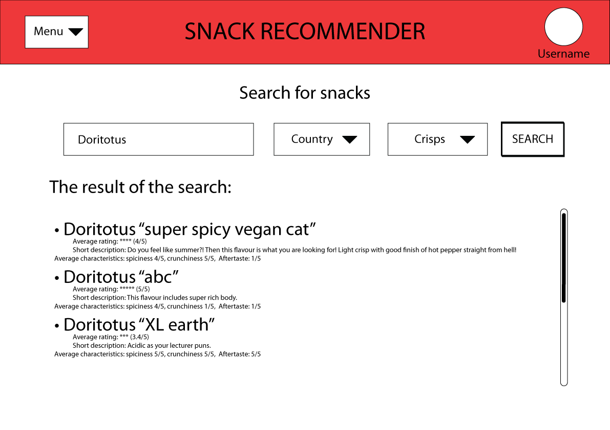
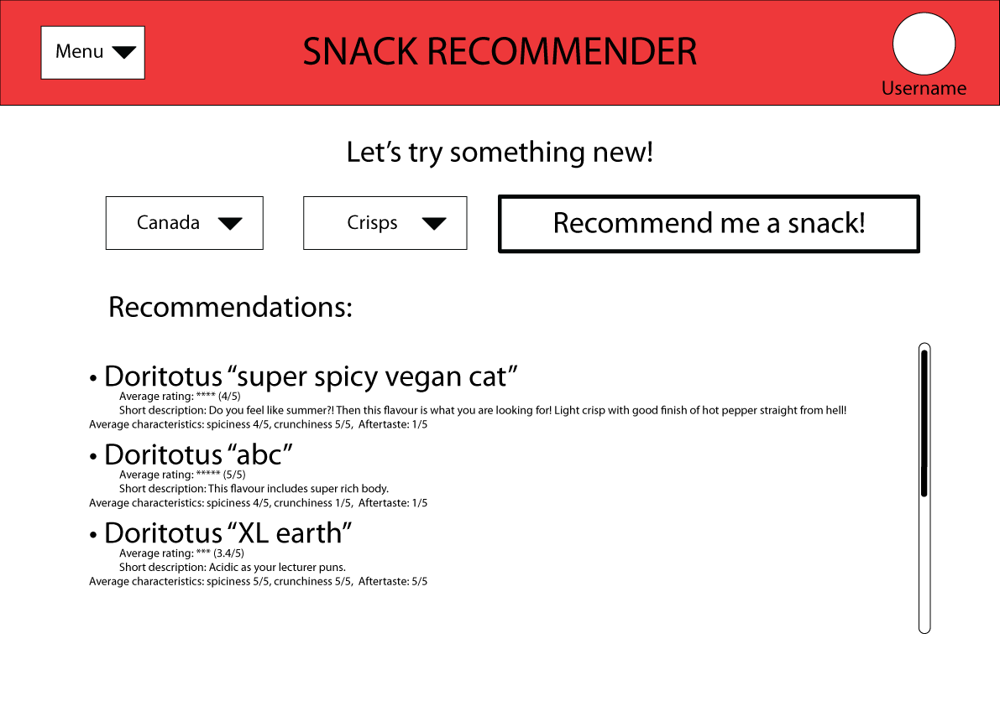
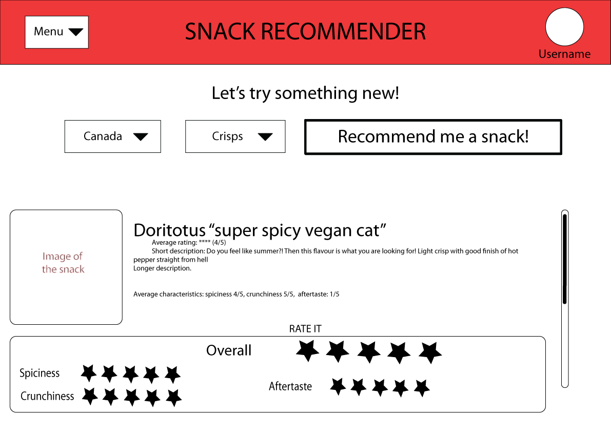
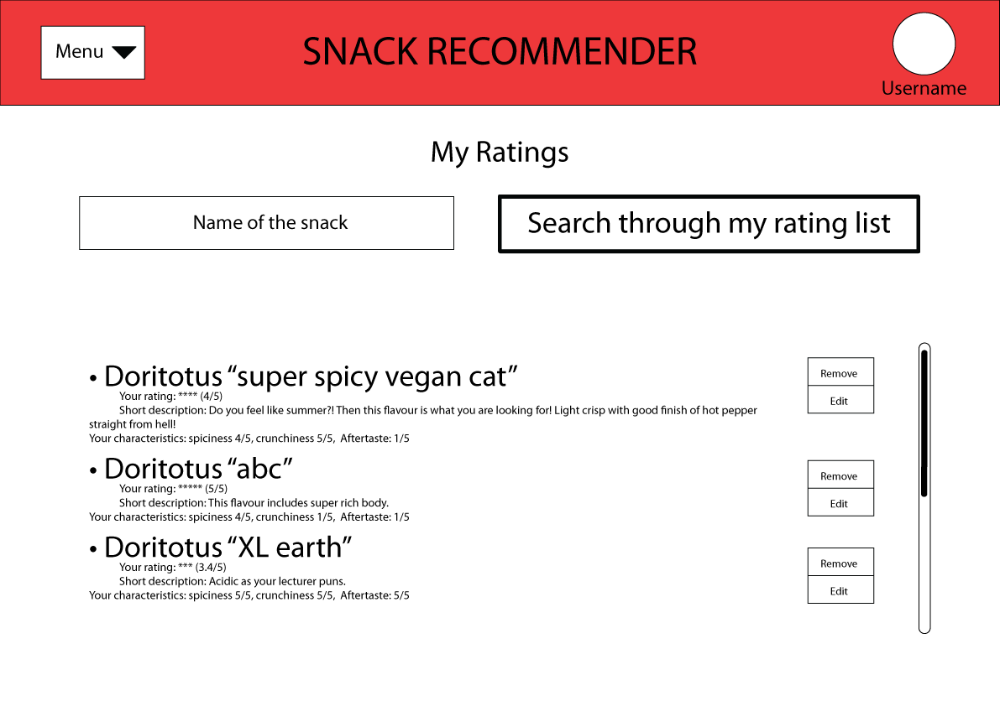

# Team 16: Snacker

#### Q1: What are you planning to build?

We are planning to build an interactive web-portal that recommends snacks to users based on their own reviews and preferences. Currently, there is no application on the market that solves the everyday dilemma of the grocery shopper and snack lover, in that they cannot explore potential interesting snacks without actually purchasing them or getting casual feedback from friends. Some exemplary use cases include:

1. the user is standing at a grocery store, looking to make a purchase decision. They open the web through their mobile browser and look at reviews and recommendations for snacks they are looking to try;
2. The user just bought some new snacks and really liked them, so they decide to open our website to put in a review for that snack in hopes of getting recommendations of other snacks that are as good as the one they just bought;
3. the user is procrastinating and decides to browse through the personalized recommendation list on our web; and, to add snacks they like into their wishlist.

 

 

 

 

 

 

 

 

#### Q2: Who are your target users?

There are several target users which can be specified. The most notable user groups are the everyday snack shoppers, travellers, the snack producers and the snack distributors. Everyday,  snack shoppers can use our web app to keep track of their snacking habit and to get personalized recommendations for new snacks they may like. Being new to the region, travellers will be able to use the application to discover foreign snacks that target their taste buds. The snack producers can view the reviews on the website and modify their recipes or advertising in response. Similarly, the snack distributors can understand the snack market via the website and make target distributing decisions by running analytics on the website data. For example, snack distributors can increase supplies in areas that have higher demand of a certain product.

Persona for our four different types of users available at [xtensio](https://app.xtensio.com/nbimdqra)

#### Q3: Why would your users choose your product? What are they using today to solve their problem/need?

Currently, there is no application on the market that solves the problem we have identified. The closest on-the-market application is MunchPak ‘s Snack Scanner App (https://munchpak.com/snackscanner/); however, it only identifies snacks manufactured and distributed by MunchPak. The users would choose our product because it would record snacks without discrimination in the brand. Furthermore, our product is able to make recommendations to users based on their past reviews and preferences. Our product also saves time(approximately five minutes) for users because without this application, they would have to spend more time in the grocery store reading new snacks’ labels and feeling indecisive about what they want. The snack distributors and manufactures will use our product because there is no existing source where they can get direct feedbacks from consumers about what type of snacks they want.

### Highlights

During our collaborative process, we made the key decision to design and implement an interactive web instead of mobile app because 1) we couldn’t find a free, reliable barcode to product name API which diminishes the advantage of a mobile app since users won’t be able to use their phone to scan for product name 2) most members of our team have no mobile development experience and doing web saves time on having to learn new framework.
We decided to make users register for accounts and login to keep track of each user’s recommendation. 

As for the recommendation design, we come up with the following 4 points as possible design:
1. Each user can like a snack; user receives recommendations based on likes from users who like similar snacks to this user. The users have to login and like some snacks first before they can be given recommendations.
2. Each user gives a 5 star rating of the snack; user is given recommendations based on ratings from other users who rate snacks similarly to this user. The users have to login and review some snacks first before they can be given recommendations.
3. Each user rates snacks on metrics such as sourness, spiciness; user is given recommendations based on e.g. how sour or spicy we think the user likes based on their past ratings of the snacks. The users have to login and review some snacks based on metrics such as sourness first before they can be given recommendations.
4. Each user rates snacks on metrics such as sourness and spiciness. The user can input one snack they like and then get a list of recommendations that are rated similarly in terms of metrics. The users don’t have to login and review some snacks first, they can just input one snack they like and the app will generate a list of snacks that are rated similarly in terms of metrics such as sourness by other users.

We have decided to combine 2 and 3 so that our users can rate snacks both on generic 5 stars and on specific metrics. Then they are going to be given better recommendations from combining these two factors. And they have to login and review some snacks first before they can be given recommendation, as this encourages users to review and contribute to the snack community.

Another decision we made was how our app treats normal users, snack distributors, snack companies (manufacturers), and app admin differently, and whether we should build special portal/interface for different groups of users. We decided that we are not going to build special portal for anyone, and app admin can just use the source code to manage the app for now. We decided to not separate snack distributor user group from the regular user group since there is no way to easily verify a snack distributor (i.e. a regular shop owner) when they register for an account and we don’t want regular users register a fake snack distributor account and abuse privileges that we want to give to snack distributors. However, snack distributors can still use our app like a regular user, one possible use case for a snack distributor is shown in the persona with Shop Owner Jack. For snack companies, we decide to have them as a separate user group who are verified by their corporate email address when they register. Snack companies are allowed to verify snacks created by regular users, and create verified snacks for others too review. Snack companies are not allowed to review other snacks though.

